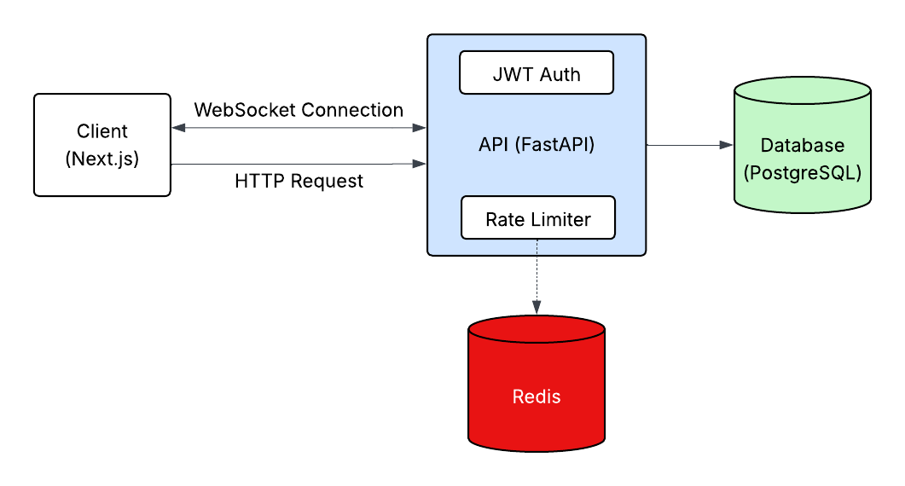

# 🧠 CampusCollab

**A smarter way to meet builders on campus.**  
CampusCollab is a full-stack web application that helps university students connect with like-minded peers based on shared skills, interests, and project goals. Whether you're looking for a hackathon partner, startup co-founder, or just someone to collaborate with, CampusCollab helps you discover and connect with the right people.

---

## 🚀 Features

### 👤 User Experience
- **Signup & Login** – Secure account creation and authentication using hashed passwords.
- **Onboarding** – Multi-step onboarding flow where users provide skills, interests, and profile info.
- **Swiping Interface** – Swipe through curated recommendations and express interest by liking or skipping.
- **Real-Time Chat** – Matched users can chat in real time using sockets.
- **Spam Protection** – Redis token-bucket rate limiting with retryAfter feedback to the client.
- **Profile Management** – Users can update their bio, skills, social links, and account credentials.

### 🤖 Smart Recommendations
- **Vector Embeddings** – User profiles are embedded using a SentenceTransformer model for semantic similarity.
- **Recommendation Engine** – Similar users are ranked using cosine similarity and stored for quick access.
- **Scheduled Updates** – An AWS Lambda function periodically updates recommendations in the background.

---

## 🛠️ Tech Stack

### Frontend
- **Framework**: [Next.js](https://nextjs.org/)
- **UI**: Tailwind CSS, Framer Motion, Radix UI, MUI, Lucide Icons
- **Real-Time**: WebSockets via `socket.io-client`

### Backend
- **API Server**: FastAPI for REST and WebSocket endpoints
- **Auth**: JWT-based authentication with secure password hashing
- **Database Access**: Supabase client for interacting with PostgreSQL and calling RPCs

### Machine Learning
- **Embeddings**: `sentence-transformers` (MiniLM model)

### Infrastructure
- **Database**: PostgreSQL (managed by [Supabase](https://supabase.com/))
- **Scheduled Tasks**: AWS Lambda + EventBridge (for recommendation updates)

---

## 🧪 Setup

### Frontend
`cd frontend`\
`npm install`\
`npm run dev`

### Backend
Open a new terminal.

#### 1) Start Redis (required for rate limiting)
Make sure Docker is running, then in a terminal: \
`docker run -d --name redis -p 6379:6379 redis:7-alpine`

#### 2) Run the API

`cd backend`\
`python3 -m venv venv`\
`source venv/bin/activate`\
`pip3 install -r requirements.txt`\
`python -m uvicorn main:app --reload`

